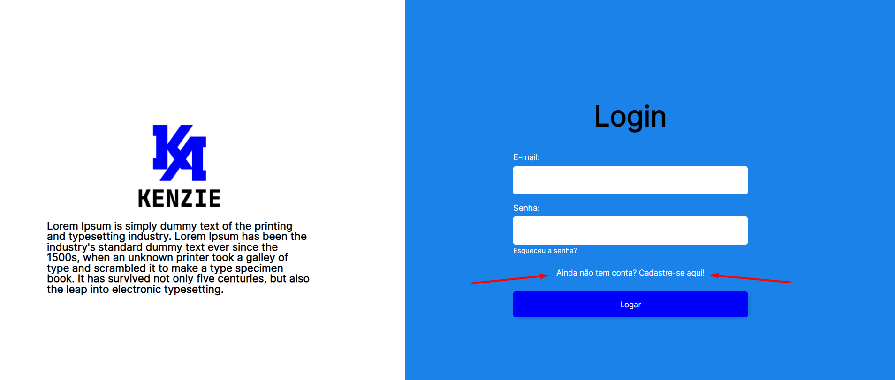

<h1>Atividade - Página de Login</h1>

<h3>Introdução</h3>
Nessa atividade vamos exercitar muitos dos conceitos que vimos até aqui, desde organização de código até implementação de estilos e dinamização com o DOM, então antes de pôr a mão no código vamos começar pelo planejamento e organização do nosso projeto.

Você terá uma página de login pronta, para coloque uma modal para cadastrar um novo usuário. Use tudo que aprendeu com as aulas anteriores sobre modais para concluir essa atividade.

Abaixo você verá uma imagem da página de login.

Utilize o texto "Ainda não tem conta? Cadastre-se aqui!" para criar o evento que chama a sua modal.

<h4>Requisitos desta Atividade</h4>
Criar componente de modal dinâmico e utilizar onde for preciso.
 
 

<b>Taken from Kenzie Academy Brasil</b>

