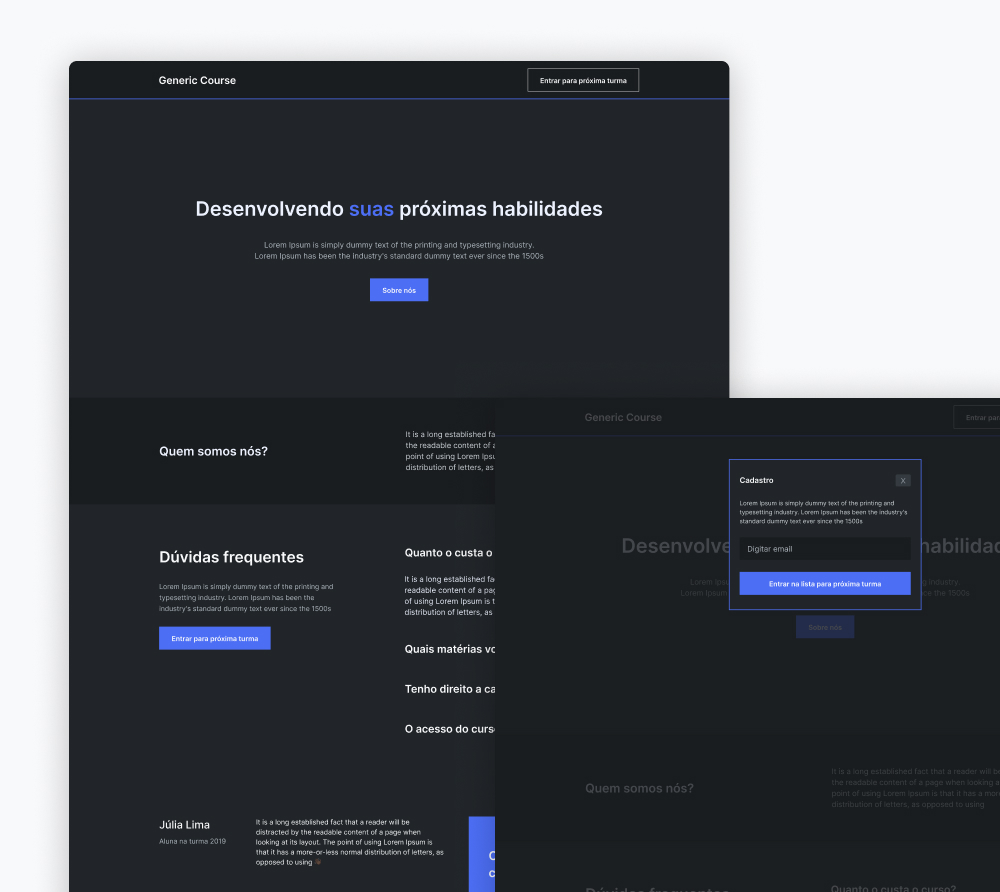

<h1>Entrega 1 | Criando Site Institucional Genérico</h1>

<h3>Introdução</h3>
Nessa entrega vamos disponibilizar um layout no <a href="https://www.figma.com/file/stLg9Yk0hCj0QHwnBnldc7/P%C3%A1gina-Institucional-Gen%C3%A9rica?node-id=0%3A1">Figma</a> de um site
institucional genérico de um suposto curso de programação.

Exercitaremos os conceitos de CSS vistos até aqui, trabalhando com position, variáveis no CSS, além de criar um modal para nossa aplicação.

<h4>O que devo fazer nessa Entrega?</h4>
Sua tarefa é estilizar e implementar a página conforme os seguintes
critérios:

- Deixar o cabeçalho fixo no topo da página.
- Separar as cores necessárias para estilização em variáveis.
- Posicionar os elementos seguindo o Figma.
- Abrir um modal com formulário ao clicar no botão “Entrar para a próxima turma”.
- Ao abrir o modal, a página ao fundo não pode ser acessada.
 
 

<b>Taken from Kenzie Academy Brasil</b>

