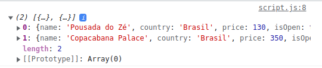
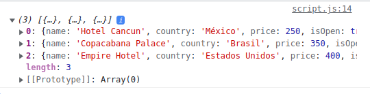
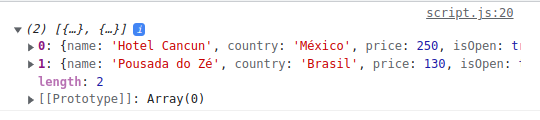
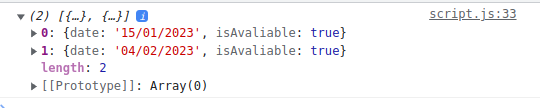

<h1>Atividade - Criando Filtro de Dados</h1>

<h3>Sobre a atividade</h3>
Nessa atividade praticaremos o método de array filter aprendido na última aula. Através dele, conseguiremos manipular um array e filtrar apenas os elementos que satisfaçam as nossas condições dentro da função, sem usar necessariamente um looping. Bora lá?

Mão na massa! 

Ao clonar o repositório, você terá a seguinte organização:

index.html
script
data.js
script.js

Dentro da pasta script, terá um arquivo data.js, contendo um array de objetos, chamado data, possuindo alguns hotéis ao redor do mundo que você tem muita vontade de conhecer (afinal, viajar é ótimo, né?), com algumas informações de nome, preço da hospedagem, funcionamento e disponibilidade de reserva.

Sua tarefa é desenvolvedor as seguintes funções:

<h3>1- Filtre os hotéis localizados no Brasil.</h3>
<h3>2- Filtre os hotéis que possuem o preço igual ou maior que R$200,00.</h3>
<h3>3- Filtre os hotéis abertos nesse momento (isOpen).</h3>

Você deverá criar a sua lógica no arquivo script.js e chegar aos seguintes resultados:

Exercício 1:

Exercício 2:

Exercício 3:

<h3>Desafio</h3>
Esse exercício contém um nível de dificuldade maior. Tente fazer sozinho, caso não consiga, a equipe de ensino está a sua disposição.

Crie uma função que filtre apenas o hotel com o nome “Copacabana Palace”. Após isso, crie outra função para verificar as datas disponíveis para agendamento nesse hotel (isAvaliable).

O resultado será:

<h3>Conclusão</h3>
Essa atividade promoveu desafios na manipulação de dados dentro de array's utilizando o método filter. Viu como é fácil? Não se esqueça de praticar e utilizá-lo em seus códigos daqui para frente!
 
 

<b>Taken from Kenzie Academy Brasil</b>

