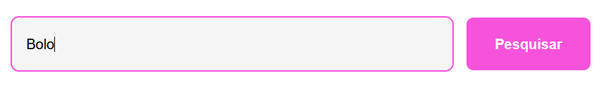

<h1>Pesquisando por dados</h1>

<h3>Introdução</h3>
Fala dev!

Nesta atividade iremos exercitar o método filter e includes criando uma função que pesquisa pelo nome de um produto em uma lista, e retorna o resulta para o usuário. Para iniciarmos, preciso que clone esse repositório.

<h3>Ambientação</h3>
No projeto clonado, você encontrará a seguinte estrutura de pastas e arquivos:

index.html
styles.css
scripts
database.js
lista de produtos
render.js
script.js
Arquivo para desenvolver sua lógica

Para a atividade de hoje, só será necessário utilizar o arquivo script.js para desenvolver sua lógica, e o database.js para verificar a lista de produtos.

<h4>Arquivo script.js</h4>
No arquivo irá conter a função procuraSobremesa que recebe como parâmetro valorDoInput. Não será necessário chamar essa função, pois ela já está sendo chamada em outro arquivo e sendo passado o parâmetro, porém, para o seu funcionamento, é obrigatório retornar uma lista de produtos no return da função.

O parâmetro valorDoInput, como o nome diz, irá conter o valor do input, e você deve utilizá-lo para criar a lógica da pesquisa.

<h4>Arquivo database.js</h4>
Aqui você irá encontrar o array listaDeSobremesas, que contem todos os produtos que estão sendo mostrados em tela. É possível utilizá-lo no arquivo script.js normalmente

<h3>Testando a função</h3>
Para testar a função, é necessário inserir um texto no input e clicar no botão “Pesquisar”: 
 

<h3>Desafio</h3>
Crie uma lógica na função procuraSobremesa, que retorna apenas uma lista com produtos que contenham o nome que o usuário inseriu no campo de pesquisa. Para esse desafio será necessário utilizar o método filter e includes.

<h4>Resultado esperado</h4>
Caso o usuário insira “limão” no campo de pesquisa, deve ser mostrado apenas os itens que contenham limão no nome, como “Torta de limão” e “Mousse de limão”. Por exemplo: 
 

<h3>Extra</h3>
Agora com a lógica já desenvolvida, podemos perceber que ao pesquisar “chocolate”, com a letra inicial minúscula, não é mostrado os itens “Chocolate branco” e “Chocolate”, como o esperado. 
 

O seu trabalho é utilizar o método de string toLowerCase para possibilitar a busca de produtos sem a necessidade de as letras maiúsculas ou minúsculas corresponderem ao nome do produto pesquisado.

<h4>Resultado esperado</h4>

<h3>Conclusão</h3>
Nessa atividade criamos a lógica de um campo de pesquisa utilizando métodos de array. Esse conhecimento será muito utilizado na nossa vida de desenvolvedor, então lembre sempre de rever e fixar bem os conceitos utilizados nessa atividade!
 
 

<b>Taken from Kenzie Academy Brasil</b>

