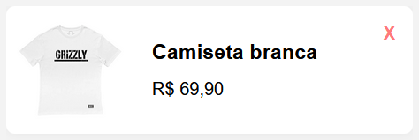
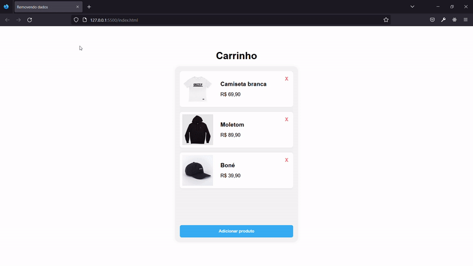

JavaScript | Atividade - Removendo Dados

Introdução
Fala, dev!

Nesta atividade iremos exercitar o método findIndex e splice criando uma função que encontra o índice do produto, e o remove do array. Para iniciarmos, preciso que clone esse repositório.

Ambientação
No projeto clonado, você encontrará a seguinte estrutura de pastas e arquivos:

index.html
styles.css
scripts
database.js <-- lista de produtos
script.js <-- Arquivo para desenvolver sua lógica
strict // Não é necessário acessar esta pasta para desenvolver a atividade

Para a atividade de hoje, só será necessário utilizar o arquivo script.js para desenvolver sua lógica, e o database.js para verificar a lista de produtos.

Arquivo script.js
Neste arquivo irá conter a função removeDoCarrinho, que recebe como parâmetro produto. Não será necessário chamar essa função, pois ela já está sendo chamada em outro arquivo e sendo passado o parâmetro, porém, para o seu funcionamento, é obrigatório retornar o produto removido (resultado do método splice) no return da função.

<!-- // script.js

function removeDoCarrinho(produto) {
   /* desenvolva sua lógica aqui */

   return /* Lembre-se de retornar o produto removido aqui */
} -->

O parâmetro produto, irá conter um objeto que é o produto que deve ser removido. Você deve utilizá-lo para criar a lógica de removê-lo do array.

Arquivo database.js
Aqui você encontrará o array listaDoCarrinho, que contem os itens que estão no carrinho. É possível utilizá-lo no arquivo script.js normalmente, como mostra o exemplo abaixo:

<!-- // database.js

function removeDoCarrinho(produto) {
   console.log(listaDoCarrinho) // irá exibir os produto do carrinho no console
} -->

Testando a função
Para testar a função, é necessário Clicar no botão “X” e checar se há algum erro no console.

Desafio 
Crie uma lógica na função removeDoCarrinho, que encontra o índice do produto no array listaDoCarrinho, e o remove. Para esse desafio será necessário utilizar o método findIndex e splice.

Resultado esperado do desafio
Caso o botão de remover do produto seja clicado, o item deve ser removido do array listaDoCarrinho e da tela, como mostra o exemplo abaixo:

Lembre-se, para que os elementos sejam removidos da tela, sua função deve retornar o produto que foi removido, no caso, o resultado do método splice.

Conclusão
Nessa atividade criamos a lógica de remover produtos de um array. Esse conhecimento será muito utilizado ao trabalharmos com carrinho ou listas que possibilitam a remoção de itens, como uma lista de a fazer (To-do)! Até a próxima!