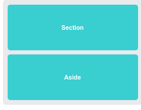
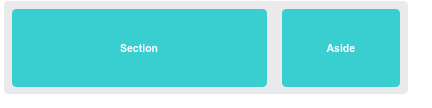

CSS | Atividade - Colunas Responsivas

Introdução
Nessa atividade vamos praticar um pouco sobre os conceitos de Media Queries. Crie uma página HTML (index.html) e uma folha de estilo (style.css). Você precisará criar os elementos necessários no seu html e as adicionar regras no seu arquivo style.css para conseguir que sua página se pareça com a imagem exemplo.

Tente criar a página utilizando o conceito de mobile first, onde os dois terão 100% da largura da tela.

Tente sempre, por boa prática, utilizar o conceito de mobile first nas suas aplicações.

A partir daqui entra suas media queries, transformando o elemento e deixando a tag section com 70% da largura da tela e a tag aside com o restante.

