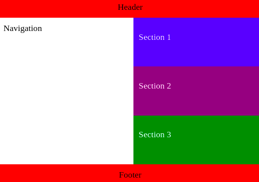
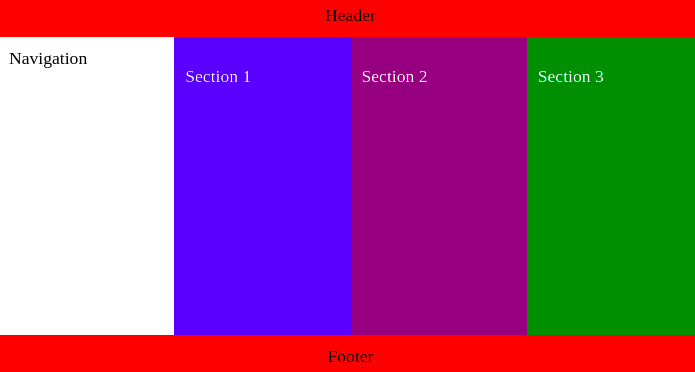

CSS | Atividade - Aplicando conceitos de Media Queries

Introdução
Neste exercício, você irá estilizar um layout especifico que está localizado na plataforma Codepen, acesse o exercício aqui.

Neste exercício, você irá converter um layout projetado para se enquadrar no modelo mobile first, modificando para que ele funcione perfeitamente em telas maiores.

O objetivo geral dessa atividade é treinar os conceitos de mobile first, dimensionamento, posicionamento, flexbox e media queries.

1. Para telas maiores do que 480 píxeis:
Permitir a quebra de linha dos itens de um artigo.
Forçar a barra lateral a ocupar 100% da altura do parent dela.

2. Para telas maiores do que 640 píxeis:
As seções também devem ocupar 100% da altura do parent dela.

Dica!

Você precisa apenas de propriedades flexbox para fazer isso funcionar. Aqui está uma lista das propriedades que podem te auxiliar:

flex-wrap
flex-basis
flex-direction