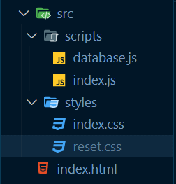

JavaScript | Atividade trabalhando com múltiplos arquivos JS

Sobre a atividade
Nesta atividade exercitaremos a troca de informações entre vários arquivos javascript utilizando a sintaxe de import e export.

Mão na massa! 
Para começar, clone este repositório.

Ao clonar o repositório, você terá a seguinte organização:

Na pasta src/scripts existem dois arquivos: database.js e index.js, o arquivo database.js contém dois arrays: users contendo os usuários e suas informações e books contendo informações de alguns livros.

Sua tarefa é fazer com que os usuários e livros sejam renderizados na tela, mas mantendo apenas um script lincado ao seu html.

Começaremos analisando nosso html, e adicionando ao final do body a tag script com a propriedade type="module";
Iremos ao arquivo src/scripts/database.js e adicionaremos a palavra export aos arrays;
Na primeira linha do arquivo src/scripts/index.js importaremos nossos arrays;
No arquivo src/scripts/index.js, desenvolveremos toda a lógica de renderização, utilizando os arrays importados.

Desafio 
Faça sua página ficar responsiva, e utilize o conceito de mobile first.

Esta atividade promoveu desafios na manipulação de múltiplos arquivos javascript, além de incentivar a utilização dos novos conceitos CSS aprendidos na Sprint.