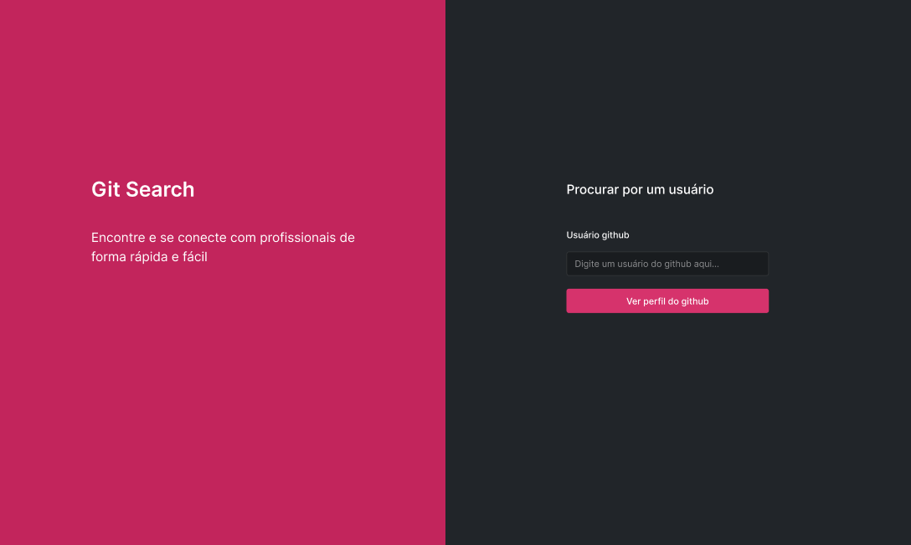

<h1>JS | Git Search teste</h1>

<h3>Introdução</h3>

Nesta entrega utilizaremos a Github API, se atente sempre a documentação oficial.

Nesta entrega disponibilizaremos um desafio para você, onde você poderá demonstrar seus conhecimentos com:

- Consumo de APIs
- Navegação entre páginas
- E tornar a interface fiel ao protótipo do Figma utilizando CSS.

<h3>Qual aplicação vou desenvolver?</h3>
O nome da aplicação que criaremos é Git Search, um ambiente virtual visando fornecer um layout simples e intuitivo quando estamos procurando por um desenvolvedor e queremos ver seus repositórios públicos.

<h3>Para iniciar:</h3>

Acesse o layout da aplicação no <a href="https://www.figma.com/file/bIs9q6AvhwT3IKNJknuOyx/Git-Search?node-id=0%3A1">Figma</a>

<h4>Fluxo</h4>

- Entrar na página inicial;
- Procurar por um usuário no Github por meio do input;
- Caso o usuário não seja encontrado, o mesmo será redirecionado para a página 404;
- Caso seja encontrado, visualizar página com os dados do usuário pesquisado, como:  
avatar  
nome  
repositórios:  
Nome  
Descrição  
Link do repositório  

<h3>Desenvolvimento</h3>
Na parte do desenvolvimento precisaremos criar, além do layout, as funcionalidades que serão:

<h4>Página inicial:</h4>

- Buscar os dados da API do Github com base no valor (value) do input da página inicial
- Caso o usuário não seja encontrado, redirecione a aplicação para a página com a mensagem "Ooops! Não encontramos o usuário que você procurou, vamos tentar novamente."
- O Botão "Nova Busca" deve redirecionar o usuário para a página inicial;

<h4>Página Home:</h4>

- Renderizar os dados do usuário pesquisado, como:  
avatar  
nome  
repositórios:  
Nome  
Descrição  
Link do repositório  

Criar funcionalidade capaz de enviar o usuário para a página inicial, por meio do clique do link no navbar com o texto "Trocar de usuário"
 
 

<b>Taken from Kenzie Academy Brasil</b>

